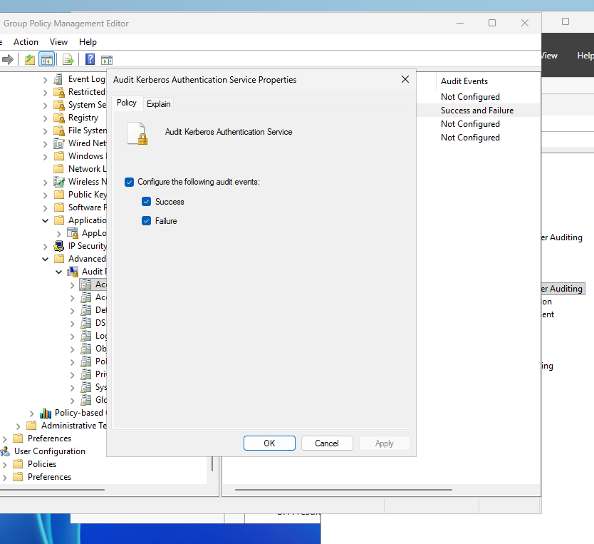
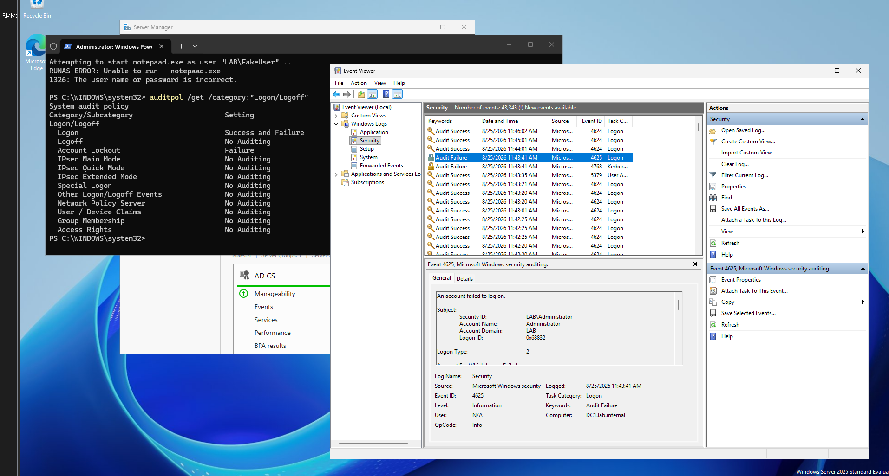
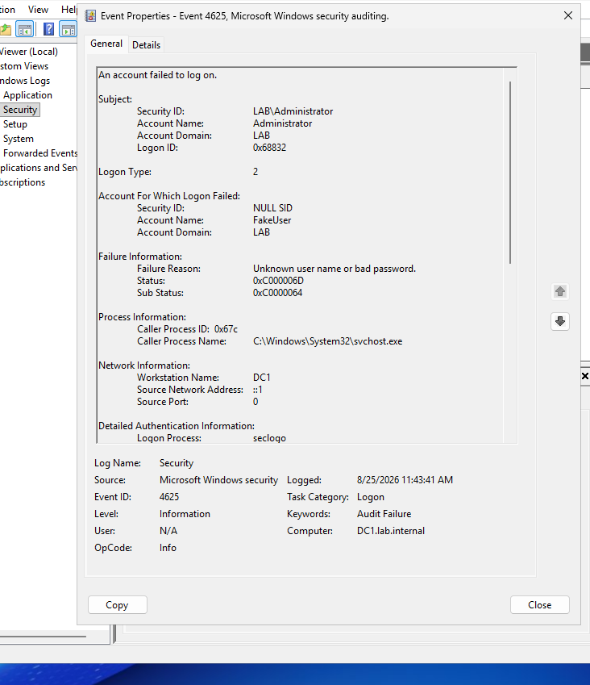

# ad-audit-policies
Implementation of AD Audit Policies via Group Policy, event log generation, and event ID security telemetry analysis.
# Active Directory Audit Policy & Security Event Telemetry Lab

This repository documents the deployment of granular Windows Audit Policies via Group Policy, along with the generation, capture, and detailed analysis of Active Directory security telemetry (Logon Failure Event ID 4625).

---

## Technical Overview

* **Domain Controller:** `DC1.lab.internal`
* **Target Domain:** `LAB`
* **Policy Applied:** Advanced Audit Policy Configuration
* **Monitored Security Events:**
  * **Event ID 4625:** An account failed to log on (Audit Failure)
  * **Event ID 4768:** A Kerberos authentication ticket (TGT) was requested
* **CLI Validation Utility:** `auditpol.exe`

---

## Configuration & Verification

### 1. Advanced Audit Policy GPO Deployment
Configured granular security auditing settings under **Computer Configuration > Policies > Windows Settings > Security Settings > Advanced Audit Policy Configuration**:
* **Account Logon:** Configured `Audit Kerberos Authentication Service` for both **Success** and **Failure** events.
* **Logon/Logoff:** Enabled **Success and Failure** auditing for user logon attempts.

---

### 2. Telemetry Generation & Policy Audit (`auditpol`)
Verified audit policy settings via PowerShell using `auditpol /get /category:"Logon/Logoff"`. Generated an intentional authentication failure by triggering a secondary process with nonexistent credentials (`runas /user:"LAB\FakeUser" notepad.exe`).

* **Execution Command:** `RUNAS ERROR: Unable to run - notepad.exe (1326: The user name or password is incorrect)`
* **Active Policy Status:** `Logon: Success and Failure` | `Account Lockout: Failure`

---

### 3. Forensic Analysis: Event ID 4625 Breakdown
Inspected the generated **Audit Failure** event log inside Windows Event Viewer to validate essential SOC indicators:

* **Event ID:** `4625` (Account Failed to Log On)
* **Logon Type:** `2` (Interactive Logon)
* **Target Account Name:** `FakeUser`
* **Caller Process Name:** `C:\Windows\System32\svchost.exe`
* **Status Code:** `0xC000006D` (*Logon failure due to unknown user or bad password*)
* **Sub Status Code:** `0xC0000064` (*User name does not exist*)

---

## Implementation Summary

1. Enforced granular security logging via **Advanced Audit Policy Configuration** GPOs across domain.
2. Simulated unauthorized access/failed authentication using `runas` with invalid domain user parameters.
3. Used `auditpol` to verify local execution of logon audit categories.
4. Extracted logon type metrics, failure codes, and process caller information from Windows Event ID `4625` for SIEM readiness.
